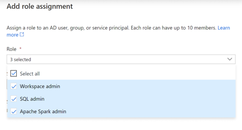
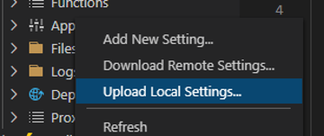

# Manual Deployment Guide  
  
We are currently working on an automated deployment process for this solution accelerator. Until this becomes available, here is the Manual Deployment Guide for deploying this Solution Accelerator.  

## Step 1: Get the data required for this Accelerator  
1. We are using the data provided by [this Kaggle Open Dataset](https://www.kaggle.com/mkechinov/ecommerce-behavior-data-from-multi-category-store), and you will need to download the data to your local machine. You will need the following CSVs/Datasets (download them):  
    - 2019-Oct.csv  
    - 2019-Nov.csv  
    - 2019-Dec.csv.gz (available [here](https://drive.google.com/drive/folders/1Nan8X33H8xrXS5XhCKZmSpClFTCJsSpE))   
    - 2020-Jan.csv.gz (available [here](https://drive.google.com/drive/folders/1Nan8X33H8xrXS5XhCKZmSpClFTCJsSpE))  

## Step 2: Deploy Azure Synapse Analytics (workspaces preview)  
1. Go to the Azure Portal and click "Create a resource"  
2. **Search** for "Azure Synapse Analytics (workspaces preview)" and click "Create" on the **Resource Page**  
3. Specify your subscription and resource group that you would like to use for the Synapse workspace  
4. Specify the workspace details:  
    - Name: 8 to 32 lowercase characters  
    - Region: Choose your region  
    - Select Data Lake Storage Gen2  
        - Choose "From Subscription"  
        - Choose "Create New" for both the Account Name and Filesystem  
            - **NOTE**: keep track of these values, these are the primary storage account details for your workspace  
5. Go to "Security + Networking"  
    - Set a password and change the username, if desired  
    - **Leave everything else as the default setting**  
6. Go to "Summary" and click Create after the deployment is validated  

## Step 3: Upload Assets and Data to the Synapse Workspace  
1. After the deployment finished go to your Synapse workspace resource page in the Azure Portal  
2. Create a SQL Pool and a Spark Pool  
3. Before getting into Synapse Studio, go and upload the data from Step 1 to the Data Lake that you specified in the deployment to be the attached storage of Synapse Studio  
    - The data should go into the filesystem you specified in the deployment of Synapse, and should go into the `synapse\workspaces` folder  
4. Once the data is in the Data Lake, launch the Synapse Studio:  
    - Go to the resource page in the portal and click the "Launch Synapse Studio"
5. Go to "Develop", click the "+", and click Import (you will need to do this twice, once for the Spark Notebooks and once for the SQL Scripts):  
    - In the demo's repository, go to `1. Analytics Deployment\synapse-studio\notebooks` to select all of the the Spark Notebooks  
    - In the demo's repository, go to `1. Analytics Deployment\synapse-studio\sqlscripts` to select all of the the SQL Scripts  
6. Click Publish and confirm the assets to be published  
7. Go to the "Manage" tab in the Studio and click on the Apache Spark pools  
8. Click on the Spark Pool that you deployed and click "Packages, then click "Upload environment config file"  
    - Go to `1. Analytics Deployment\synapse-studio\cluster_config` to get the requirements.txt for upload  
9. Ensure that you give yourself and any other user admin privilages for this accelerator by going to the `Manage` tab, then `Access control` underneath `Security` and click "+ Add"
    -   
10. Now click the Role dropdown and select all three roles, and search for your username and the other user's usernames to be added by using the search bar underneath the Role dropdown  
    -   
    -   
11. Click Apply at the bottom of the window.  
10. Now the environment should be ready to go for the execution of the scripts  
  
## Step 4: Running of the Notebooks and SQL Scripts  
1. Configure / Fill out the Parameters and then Run the following notebooks and scripts in order:  
    1. `01_setup_sql_object.sql`  
        > You can follow [this guidance](https://docs.microsoft.com/en-us/azure/synapse-analytics/sql/access-control) for more details on managing user identities and permissions in Azure Synapse Analytics workspaces 
    2. `01_CreateOrUpdateProductDetails`  
    3. `02_Clean_Training_Data`  
    4. `03_ALS_Model_Training`  
    5. `04_RecommendationRefresh`  
    6. `02_create_shopper_rec_table.sql`  
    7. `03_create_product_detail_table.sql`  
2. After all of these have been run successfully, the recommendations will have been generated for the User-Based Recommendations, and the model will be ready for deployment for the Item-Based Recommender served on Azure Kubernetes Service.  
  
## Step 5: Setting Up the data for the Recommendation APIs
### Set up the Index for the User-Based Recommendations in Azure Search  
1. Deploy Azure Cognitive Search to your resource group  
2. Go to the Azure Cognitive Search resource in the Azure Portal  
3. Click `Import Data` and choose `Azure SQL Database` in the drop down menu for `Data Source`  
    -   
4. Enter in the following:  
    - Data source name: Choose whatever name fits within the guidelines  
    - Connection String: Follow the instructions below  
        1. Click `Choose an existing connection`  
        2. Choose the SQL Pool that you provisioned for your Synapse Studio  
    - User Id: Should be populated by completing the steps for Connection String  
    - Password: Enter in the sqladmin password that you designated during the deployment of the Synapse Studio  
5. Press `Test connection`  
6. For `Table/View` choose `top_shopper_recommendations`  
7. Click the `Next: Add cognitive skills (Optional)` button at the bottom of the panel  
8. Click `Skip to: Customize target index` at the bottom of the panel  
9. Configure the Index by following the picture below:  
    -   
    - Click `Next: Create an indexer`  
10. Configure the Indexer by following the picture below:  
    -   
11. Click Submit  
  
### Set Up the Index for the Product Details Table  

1. Repeat Steps 3-11 from above for the product_detail table that you created in the Synapse Studio  
2. Index Configuration  
    -   
3. Indexer Configuraion  
    -   
4. Click Submit  
  
### Set Up the Item-Based Recommendation Web Service  
> In this section we will set up the Item-Based Recommendation Web Service by using Azure Machine Learning Service to package and deploy the model and Azure Kubernetes Service to host the model.  
#### Deploy the resources  
> You will need the [Azure CLI](https://docs.microsoft.com/en-us/cli/azure/install-azure-cli?view=azure-cli-latest) for this part, install it [from here](https://docs.microsoft.com/en-us/cli/azure/install-azure-cli?view=azure-cli-latest).  
> You will also need Python 3.7+ installed on your local mahcine.  
1. Go to the Azure Portal and deploy a Azure Machine Learning Services resource into the resource group that you are using for this Solution Accelerator.  
    - You can search for `Machine Learning` after clicking on `Create a resource` to get the correct resource.  
    - **NOTE**: Along with the service comes the following:  
        - Azure Key Vault  
        - Azure Storage  
        - Azure Application Insights  
        - Azure Container Registry (**ATTENTION**: The name of this service will be needed in the deployment of the Azure Kubernetes Service)  
            - You can find the name of the associated Container Registry in the resource page of the deployed Azure Machine Learning Service  
2. **After the Azure Machine Learning Service is deployed,** Use the Azure CLI steps below to deploy the Azure Kubernetes Service  
    ```sh
    # After running this, it will prompt you to login to the portal or enter in a device code
    az login  
      
    # Set the subscription context, you will need the subscription ID which can be found in the resource page for the resource group that you are using for this Solution Accelerator  
    az account set --subscription <enter-subscription-id>  
      
    # Now run the following to deploy the Azure Kubernetes Cluster  
    # NOTE: You will need to replace the following:  
        # - <insert-resource-group-name>: Name of the resource group you are using for this Solution Accelerator  
        # - <insert-desired-cluster-name>: Desired name for the AKS cluster  
        # - <insert-name-of-acr>: Name of the Azure Container Resitry that was deployed along with the Azure Machine Learning Service in the previous step  
    az aks create --resource-group <insert-resource-group-name> --name <insert-desired-cluster-name> --node-count 3 --enable-addons monitoring --generate-ssh-keys --attach-acr <insert-name-of-acr>  
      
    # Now you will need to create a Service Principal and give it Contributor access to your Azure Machine Learning Service  
    # Enter in your subscription ID, resource group name and the name of your Azure Machine Learning Service  
    az ad sp create-for-rbac -n "sp_synapse_accelerator" --role contributor
    --scopes /subscriptions/{subscription-id}/resourceGroups/{resource-group-name}/providers/Microsoft.MachineLearningServices/workspaces/{amls-name}  
    ```  
    - **NOTE**: Save the details of this Service Principal for future steps  
      
3. In the repository on your local machine, open `1. Analytics Deployment\amls\model_deployment\` in an IDE like VS Code  
4. Run `pip install -r requirements.txt`  
5. Edit the `download_model.py` file:  
    -  In the file `download_model.py`, edit the following:  
        ```python
        # Enter the name of the Azure Data Lake Storage Gen2 Account
        DATA_LAKE_NAME=""
        # Enter the name of the filesystem
        DATA_LAKE_FILE_SYSTEM_NAME=""
        # Enter the Primary Key of the Data Lake Account
        DATA_LAKE_PRIMARY_KEY=""
        ```  
    - Now run `python download_model.py`  
        - This should create a ZIP of the model on your local machine.  
6. Before deploying the model, edit the `score.py` file and the `deploy_model.py` file.  
    - `score.py` at the top of the file in the `init()` function:   
        ```python
        def init():
            ## Add in your Data Lake Details Here
            
            ## The DATA_LAKE_NAME should be the attached Data Lake to your Synapse Studio where the saved ALS Model is
            DATA_LAKE_NAME=""
            ## DATA_LAKE_FILE_SYSTEM_NAME should be the filesystem that is attached to the Synapse Studio where the Model is saved
            DATA_LAKE_FILE_SYSTEM_NAME=""
            ## DATA_LAKE_PRIMARY_KEY is the Primary Key of the Azure Data Lake Storage Gen2 that can be found in the portal
            DATA_LAKE_PRIMARY_KEY=""
        ```  
    - `deploy_model.py`  
        ```python
        # Subscription ID for the Solution Accelerator
        SUBSCRIPTION_ID=""
        # Resource Group that you are using for the Solution Accelerator
        RESOURCE_GROUP=""
        # Found in the output of the Service Principal created earlier
        TENANT_ID=""
        # Found in the output of the Service Principal created earlier
        APP_ID=""
        # Found in the output of the Service Principal created earlier
        SP_PASSWORD=""
        # Name of the Azure Machine Learning Service that you deployed
        WORKSPACE_NAME=""
        # Name of the Azure Kubernetes Service that you deployed
        AKS_CLUSTER_NAME=""
        ```  
7. Now run `python deploy_model.py` and the model will be registered with AMLS and deployed to the AKS cluster  
    
## Step 6: Setting Up the API Infrastructure  

### Set Up the Azure Function  

#### VS Code Instructions  
  
> **Note**: Ensure that you have the pre-requisities to develop and locally debug Python Azure functions. [See here](https://docs.microsoft.com/en-us/azure/developer/python/tutorial-vs-code-serverless-python-01#visual-studio-code-python-and-the-azure-functions-extension) for details.  
1. Deploy a Azure Function App with Python as the Runtime Stack  
    - Record the value for `AzureWebJobsStorage`  
2. Open a VS Code at the following filepath of this repository: `1. Analytics Deployment\api-layer\az_func\__app__`  
3. Edit the `local.settings.json` to fill in the following values:  
    ```
    {
        "IsEncrypted": false,
        "Values": {
        "FUNCTIONS_WORKER_RUNTIME": "python",
        "SEARCH_KEY": "", // Your Azure Cognitive Search Key
        "SEARCH_SERVICE": "", // The name of the Azure Cognitive Search Service
        "AMLS_SERVICE_KEY": "", // The ML Web Service Key found in the Model Deployment in Azure Machine Learning Service
        "AzureWebJobsStorage": "", // Found in the Function App that you deployed
        "RECOMMENDATION_INDEX": "", // The name of the index for top_shoppers_recommendations_summary
        "PRODUCT_DETAIL_INDEX": "", // The name of the index for product_detail
        "SCORING_URL": "" // The Scoring URL for the Web Service, found in Azure Machine Learning Service
        }
    }
    ```
4. Go to the Azure Function Extension and publish the function to the Function App deployed in Step 1 of this section.  
5. Go to the Function App in the Extension menu of VS Code and right click on the `Application Settings` and choose `Upload Local Settings`  
    -   
  
### Set Up Azure API Management  
  
1. Deploy Azure API Management in the resource group that you are using for this Solution Accelerator  
2. In Azure API Management, go to `APIs` and choose `Function App`  
    -   
3. Choose the Function App that you deployed and import all the functions.  
4. Configure the name of your API and click Create  
  
> Now you are ready to integrate the API with your front-end by utilizing the API you built in Azure API Managment. 
    